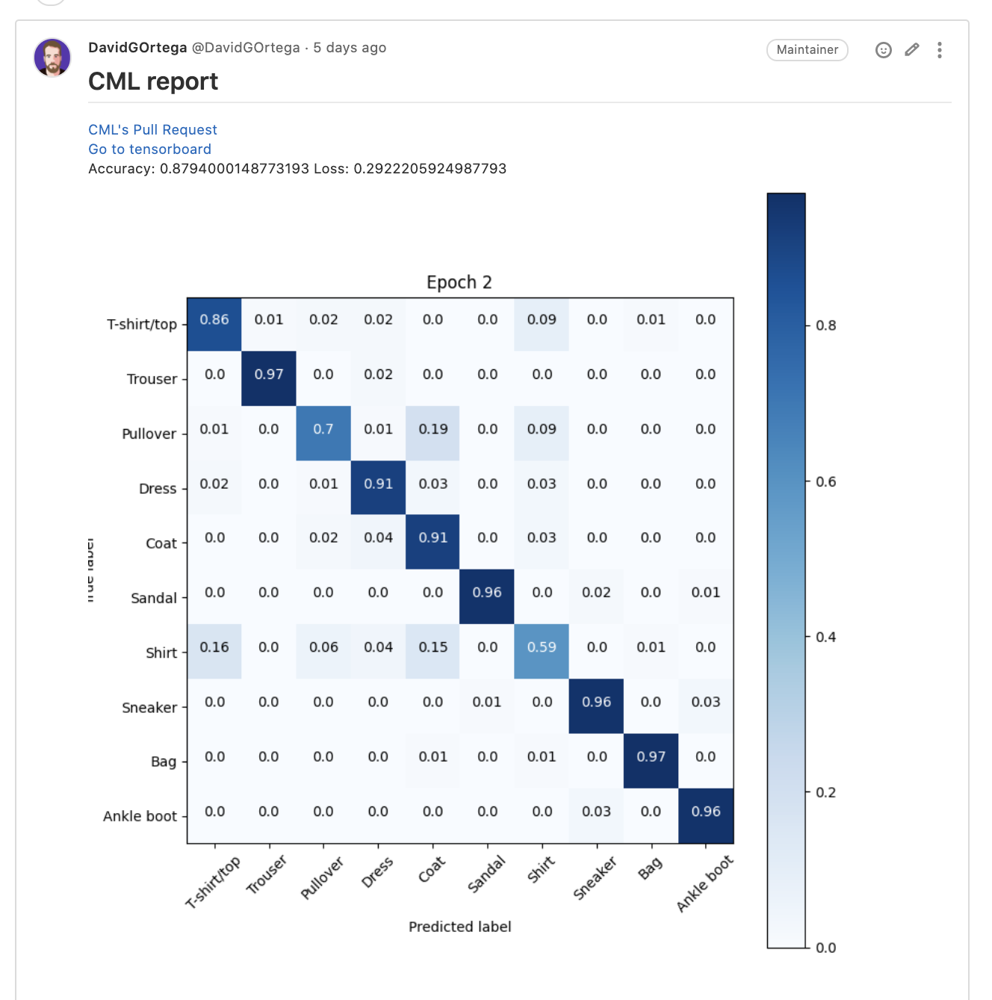
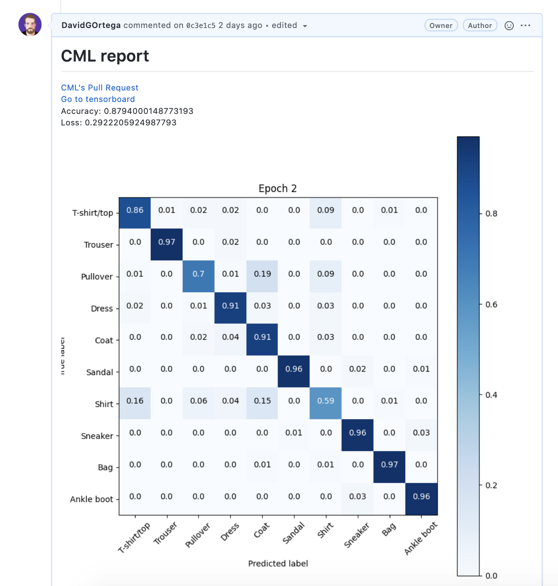

import Header from "components/organisms/SiteHeader"
import Footer from "components/organisms/SiteFooter"
import SubscribeSection from "components/molecules/SubscribeSection"

import GitFlowIcon from "media/icons/gitflow.svg"
import ReportsIcon from "media/icons/reports.svg"
import BoxIcon from "media/icons/cube.svg"

import githubVideoMp4 from "media/github/landing-video.mp4"
import gitlabVideoMp4 from "media/gitlab/landing-video.mp4"

import LandingVideo from "components/molecules/Video/LandingVideo"
import backgroundImage from "media/landing-background.png"

export default ({ children, ...props }) => {
  return (
    <>
      <main>{children}</main>
      <SubscribeSection />
      <Footer />
    </>
  )
}

<FullWidthBox sx={{
  backgroundColor: "text",
  backgroundImage: [null, null, null, `url("${backgroundImage}")`],
  backgroundPosition: "center top",
  backgroundRepeat: "no-repeat",
  color: "background",
  overflow: "hidden",
  textAlign: "center",
  Inner: {
    maxWidth: "100%",
    px: 0
  }
}}>
  <Header isMain />
  <Collapser sx={{
    variant: "layout.container",
    height: [null, null, null, "618px"],
    justifyContent: "center",
    alignItems: "center"
  }}>
    <Box sx={{flex: "1", textAlign: ["center", null, "left"]}}>
      <Heading as="h1" sx={{
        fontSize: ["32px", null, null, "42px"],
        my: 4,
        ml: 2,
        mr: [2, null, "45px"],
        maxWidth: "500px"
      }}>
        Continuous Machine Learning (CML) is CI/CD for Machine Learning Projects
      </Heading>
      <Link variant="button" href="https://github.com/iterative/cml#getting-started" target="_blank" rel="noopener noreferrer">
        Get Started
      </Link>
      <Link
          variant="button"
          sx={{
            backgroundColor: "transparent",
            border: "2px solid rgba(255, 255, 255, 0.25)",
            display: ["block", "inline-block"],
            px: "32px",
            ml: ["auto", "15px"],
            mr: ["auto", 0],
            mt: ["15px", 0],
            lineHeight: "46px",
            width: "fit-content",
            "&:hover": {
              backgroundColor:  "#704BB4",
              border:  "2px solid #704BB4",
            },
            "&:focus": {
              backgroundColor: "#9361D3",
              border: "2px solid #9361D3",
            }
          }}
          href="https://github.com/iterative/cml#install-cml-as-a-package"
          target="_blank"
          rel="noopener noreferrer"
        >
          Download
        </Link>
    </Box>
    <Box sx={{flex: "1", width: "100%"}}>
      <Switch sx={{ mt: 4, mx: "auto", maxWidth: ["100%", null, "160px"] }} />
      <Switchable
        gitlab={<LandingVideo src={gitlabVideoMp4} mode="gitlab" />}
        github={<LandingVideo src={githubVideoMp4} mode="github" />}
      />
    </Box>
  </Collapser>

  <Collapser sx={{variant: "layout.container", my: 4, flexDirection: ["column", null, null, "row"]}}>
  <HomeFeature heading="GitFlow for data science" icon={GitFlowIcon}>

Use GitLab or GitHub to manage ML experiments, track who trained ML models or
modified data and when. Codify data and models with DVC instead of pushing to
your Git repo.

  </HomeFeature>
  <HomeFeature heading="Auto reports for ML experiments" icon={ReportsIcon}>

Auto-generate reports with metrics and plots in each Git Pull Request.
Rigorous engineering practices help your team make informed, data-driven
decisions.

  </HomeFeature>
  <HomeFeature heading="No additional services" icon={BoxIcon}>

Build your own ML platform using just GitHub or GitLab and your favorite cloud
services: AWS, Azure, GCP. No databases, services or complex setup needed.

  </HomeFeature>
  </Collapser>

</FullWidthBox>

<FullWidthBox
  id="use-cases"
  sx={{
    textAlign: "center",
    py: "1px",
    fontSize: "18px",
    lineHeight: "28px",
    letterSpacing: "0.02em",
    Inner: {
      my: "80px",
      px: [0, null, null, 3]
    }
  }}
>

<Heading
  as="h2"
  sx={{
    color: "text",
    fontSize: ["32px", null, "42px"],
    lineHeight: "52px",
    fontWeight: "bold"
  }}
>
  CML Use Cases
</Heading>

<Box sx={{
  mx: "auto",
  px: "10px",
  maxWidth: "635px",
  my: "40px"
}}>

Deploy a CML spot cloud runner to train your model. 

Track your metrics with tensorboard and publish an insightful report.

Create a CML PR/MR to preserve your work.

</Box>

<Switch sx={{ my: 4, maxWidth: "160px", mx: "auto" }} />

<JSONTabs
  sx={{ "code, img": {maxHeight: "580px"} }}
  content={[
    {
    name: "CML",
    filename: "cml.yaml",
    content: (
      <Switchable
        gitlab={(
<Collapser>

```yml filename=".gitlab-ci.yml" repo="https://gitlab.com/iterative.ai/fashion-mnist"
stages:
  - deploy
  - run

deploy-runner:
  stage: deploy
  when: always
  image: dvcorg/cml:0-dvc2-base1
  script:
  <Tooltip type="runner">
    - cml-runner  
      --cloud-spot 
      --cloud aws  
      --cloud-region us-west  
      --cloud-type t2.medium 
      <Tooltip type="tip">
      --labels=cml-runner
      </Tooltip>
  </Tooltip>

run:
 <Tooltip type="tip">
  timeout: 5000 minutes
 </Tooltip>
  stage: run
  when: on_success
  tags:
    <Tooltip type="tip">
    - cml-runner
    </Tooltip>
  image: dvcorg/cml:0-dvc2-base1
  script:
    - sudo apt update && sudo apt install awscli
    - pip install -r requirements.txt
    
    <Tooltip type="tensorboard">
    - TB_URL="NOT READY"
    </Tooltip>
    <Tooltip type="reports">
    - echo "# CML report" > report.md
    - echo $TB_URL >> report.md
    - cml-send-comment report.md
    </Tooltip>

    - python train.py
    
    <Tooltip type="reports">
    - echo "# CML report" > report.md
    <Tooltip type="pr">
    - cml-pr --md output/* >> report.md
    </Tooltip>
    - echo $TB_URL >> report.md
    - cat output/metrics.txt >> report.md
    - cml-publish output/confusion_matrix.png --md >> report.md
    - cml-send-comment report.md
    </Tooltip>
```

<ExampleBox title="CML Report">

[](https://gitlab.com/iterative.ai/fashion-mnist)

</ExampleBox>

</Collapser>
        )}
        github={(
<Collapser>

```yml filename=".github/workflows/cml.yaml" repo="https://github.com/iterative/fashion-mnist"
name: train-my-model

on: [push]

jobs:
  deploy-runner:
    env:
      REPO_TOKEN: { "${{ secrets.REPO_TOKEN }}" }
      AWS_ACCESS_KEY_ID: { "${{ secrets.AWS_ACCESS_KEY_ID }}" }
      AWS_SECRET_ACCESS_KEY: { "${{ secrets.AWS_SECRET_ACCESS_KEY }}" }

    runs-on: [ubuntu-latest]
    steps:
      - uses: actions/checkout@v2
      - uses: iterative/setup-cml@v1

      - name: deploy
        shell: bash
        run: |
          <Tooltip type="runner">
          cml-runner \
          --cloud-spot \
          --cloud aws \
          --cloud-region us-west \
          --cloud-type t2.medium \
          <Tooltip type="tip">
          --labels cml-runner
          </Tooltip>
          </Tooltip>

  run:
    <Tooltip type="tip">
    timeout-minutes: 5000
    </Tooltip>
    runs-on: [
      self-hosted,
      <Tooltip type="tip">
      cml-runner
      </Tooltip>
    ]
    needs: deploy-runner
    container: 
      <Tooltip type="image">
      image: docker://dvcorg/cml:0-dvc2-base1
      </Tooltip>

    steps:
    - uses: actions/checkout@v2

    - name: cml 
      env:
        REPO_TOKEN: { "${{ secrets.REPO_TOKEN }}" }
        AWS_ACCESS_KEY_ID: { "${{ secrets.AWS_ACCESS_KEY_ID }}" }
        AWS_SECRET_ACCESS_KEY: { "${{ secrets.AWS_SECRET_ACCESS_KEY }}" }
        AWS_DEFAULT_REGION: us-east-1
        AWS_EC2_METADATA_DISABLED: true
        TB_CREDENTIALS: { "${{ secrets.TB_CREDENTIALS }}" }
      run: |
        sudo apt update && sudo apt install awscli
        pip install -r requirements.txt
        
        <Tooltip type="tensorboard">
        TB_URL="NOT READY"
        </Tooltip>
        <Tooltip type="reports">
        echo "# CML report" > report.md
        echo $TB_URL >> report.md
        cml-send-comment --update report.md
        </Tooltip>

        python train.py
        
        <Tooltip type="reports">
        echo "# CML report" > report.md
        <Tooltip type="pr">
        cml-pr --md output/* >> report.md
        </Tooltip>
        echo $TB_URL >> report.md
        cat output/metrics.txt >> report.md
        cml-publish output/confusion_matrix.png --md >> report.md
        cml-send-comment --update report.md
        </Tooltip>
```

<ExampleBox title="CML Report">

[](https://github.com/iterative/fashion-mnist)

</ExampleBox>

</Collapser>
        )}
      />
    )
  },
  {
    name: "CML + DVC",
    content: (
      <Switchable
        gitlab={(
<Collapser>

```yml filename=".gitlab-ci.yml" repo="https://gitlab.com/iterative.ai/fashion-mnist"
stages:
  - deploy
  - run

deploy-runner:
  stage: deploy
  when: always
  image: dvcorg/cml:0-dvc2-base1
  script:
  <Tooltip type="runner">
    - cml-runner  
      --cloud-spot 
      --cloud aws  
      --cloud-region us-west  
      --cloud-type t2.medium 
      <Tooltip type="tip">
      --labels=cml-runner
      </Tooltip>
  </Tooltip>

run:
  <Tooltip type="tip">
  timeout: 5000 minutes
  </Tooltip>
  stage: run
  when: on_success
  tags:
    <Tooltip type="tip">
    - cml-runner
    </Tooltip>
  image: dvcorg/cml:0-dvc2-base1
  script:
    - sudo apt update && sudo apt install awscli
    - pip install -r requirements.txt
    
    <Tooltip type="tensorboard">
    - TB_URL="NOT READY"
    </Tooltip>
    <Tooltip type="reports">
    - echo "# CML report" > report.md
    - echo $TB_URL >> report.md
    - cml-send-comment report.md
    </Tooltip>

    <Tooltip type="dvc">
    - dvc pull || echo "First pull might fail"
    - dvc exp run
    - dvc push
    </Tooltip>
    
    <Tooltip type="reports">
    - echo "# CML report" > report.md
    <Tooltip type="pr">
    - cml-pr --md output/* >> report.md
    </Tooltip>
    - echo $TB_URL >> report.md
    - cat output/metrics.txt >> report.md
    - cml-publish output/confusion_matrix.png --md >> report.md
    - cml-send-comment report.md
    </Tooltip>
```

<ExampleBox title="CML Report">

[](https://gitlab.com/iterative.ai/fashion-mnist)

</ExampleBox>

</Collapser>
        )}
        github={(
<Collapser>

```yml filename=".github/workflows/cml.yaml" repo="https://github.com/iterative/fashion-mnist"
name: train-my-model

on: [push]

jobs:
  deploy-runner:
    env:
      REPO_TOKEN: { "${{ secrets.REPO_TOKEN }}" }
      AWS_ACCESS_KEY_ID: { "${{ secrets.AWS_ACCESS_KEY_ID }}" }
      AWS_SECRET_ACCESS_KEY: { "${{ secrets.AWS_SECRET_ACCESS_KEY }}" }

    runs-on: [ubuntu-latest]
    steps:
      - uses: actions/checkout@v2
      - uses: iterative/setup-cml@v1

      - name: deploy
        shell: bash
        run: |
          <Tooltip type="runner">
          cml-runner \
          --cloud-spot \
          --cloud aws \
          --cloud-region us-west \
          --cloud-type t2.medium \
          <Tooltip type="tip">
          --labels cml-runner
          </Tooltip>
          </Tooltip>

  run:
    <Tooltip type="tip">
    timeout-minutes: 5000
    </Tooltip>
    runs-on: [
      self-hosted,
      <Tooltip type="tip">
      cml-runner
      </Tooltip>
    ]
    needs: deploy-runner
    container: 
      <Tooltip type="image">
      image: docker://dvcorg/cml:0-dvc2-base1
      </Tooltip>

    steps:
    - uses: actions/checkout@v2

    - name: cml 
      env:
        REPO_TOKEN: { "${{ secrets.REPO_TOKEN }}" }
        AWS_ACCESS_KEY_ID: { "${{ secrets.AWS_ACCESS_KEY_ID }}" }
        AWS_SECRET_ACCESS_KEY: { "${{ secrets.AWS_SECRET_ACCESS_KEY }}" }
        AWS_DEFAULT_REGION: us-east-1
        AWS_EC2_METADATA_DISABLED: true
        TB_CREDENTIALS: { "${{ secrets.TB_CREDENTIALS }}" }
      run: |
        sudo apt update && sudo apt install awscli
        pip install -r requirements.txt
        
        <Tooltip type="tensorboard">
        TB_URL="NOT READY"
        </Tooltip>
        <Tooltip type="reports">
        echo "# CML report" > report.md
        echo $TB_URL >> report.md
        cml-send-comment --update report.md
        </Tooltip>

        <Tooltip type="dvc">
        dvc pull || echo "First pull might fail"
        dvc exp run
        dvc push
        </Tooltip>
            
        <Tooltip type="reports">
        echo "# CML report" > report.md
        <Tooltip type="pr">
        cml-pr --md output/* >> report.md
        </Tooltip>
        echo $TB_URL >> report.md
        cat output/metrics.txt >> report.md
        cml-publish output/confusion_matrix.png --md >> report.md
        cml-send-comment --update report.md
        </Tooltip>
```

<ExampleBox title="CML Report">

[](https://github.com/iterative/fashion-mnist)

</ExampleBox>

</Collapser>
        )}
      />
    )
  },]}/>

</FullWidthBox>

<FullWidthBox sx={{
  backgroundColor: "gray",
  textAlign: "center",
  py: "5px",
  Inner: {
    my: "85px",
  },
}}>

<Heading
  as="h2"
  sx={{
    color: "text",
    lineHeight: "52px",
    fontWeight: "bold",
    fontSize: ["32px", null, "42px"],
  }}
>
  The MLOps Ecosystem 
</Heading>

<Box sx={{
  fontSize: "18px",
  lineHeight: "28px",
  letterSpacing: "0.02em",
  mx: "auto",
  maxWidth: "460px",
}}>

MLOps isn't a platform- it's an ecosystem of tools. 
CML helps you bring your favorite DevOps tools to machine learning. 

</Box>

<SolutionList
  sx={{
    maxWidth: "834px",
    my: "40px",
    mx: "auto",
  }}
>
  {[ 
    ["Continuous integration for ML", "CML"],
    ["Manage environments", "Docker and Packer"],
    ["Infrastructure as code", "Terraform and Docker-Machine"],
    ["Data as code", "DVC"]
  ]}
</SolutionList>

</FullWidthBox>
